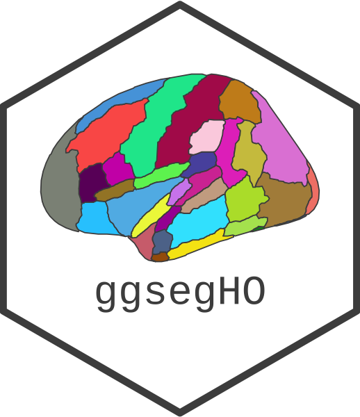

<!-- README.md is generated from README.Rmd. Please edit that file -->

```{r, include = FALSE}
knitr::opts_chunk$set(
  collapse = TRUE,
  comment = "#>",
  fig.path = "man/figures/README-",
  fig.width = 6,
  out.width = "100%",
  fig.retina = 3
)
```

# ggsegHO 

<!-- badges: start -->
[](https://codecov.io/gh/LCBC-UiO/ggsegHO?branch=master)
[](https://www.tidyverse.org/lifecycle/#maturing)
[](https://CRAN.R-project.org/package=ggsegHO)
[](https://github.com/ggseg/ggsegHO/actions)
[](https://zenodo.org/badge/latestdoi/250284032)

<!-- badges: end -->


This package contains dataset for plotting the Harvard-Oxford cortical atlas ggseg and ggseg3d. 

Makris,et al. (2006) Schizophrenia research 83(2-3):155-151
[pubmed](https://doi.org/10.1016/j.schres.2005.11.020)

## Installation

We recommend installing the ggseg-atlases through the ggseg [r-universe](https://ggseg.r-universe.dev/ui#builds):

```{r eval = FALSE}
# Enable this universe
options(repos = c(
    ggseg = 'https://ggseg.r-universe.dev',
    CRAN = 'https://cloud.r-project.org'))

# Install some packages
install.packages('ggsegHO')
```

You can install the released version of ggsegHO  from [GitHub](https://github.com/) with:

``` r
# install.packages("remotes")
remotes::install_github("LCBC-UiO/ggsegHO")
```

## Example

This is a basic example which shows you how to solve a common problem:
```{r}
library(ggsegHO)
```

```{r, fig.height=10}
library(ggseg)
library(ggplot2)

plot(hoCort) +
  theme(legend.position = "bottom",
        legend.text = element_text(size = 6)) +
  guides(fill = guide_legend(ncol = 3))
```

<!-- ```{r "noneval", eval=FALSE} -->
<!-- library(ggseg3d) -->

<!-- ggseg3d(atlas = desterieux_3d) %>%  -->
<!--   pan_camera("right lateral") -->
<!-- ``` -->

<!-- ```{r "orca", include=FALSE} -->
<!-- library(ggseg3d) -->

<!-- p <- ggseg3d(atlas = desterieux_3d) %>% -->
<!--   pan_camera("right lateral") %>% -->
<!--   plotly::add_annotations( text="Screen capture", -->
<!--                   legendtitle=TRUE, showarrow=FALSE, -->
<!--                   font = list(color = "#000000b4", -->
<!--                               family = 'sans serif', -->
<!--                               size = 50)) -->
<!-- plotly::orca(p, "man/figures/README-3d-plot.png") -->
<!-- ``` -->

<!-- ```{r "incl", echo=FALSE} -->
<!-- knitr::include_graphics("man/figures/README-3d-plot.png") -->
<!-- ``` -->

Please note that the 'ggsegHO' project is released with a
[Contributor Code of Conduct](CODE_OF_CONDUCT.md).
By contributing to this project, you agree to abide by its terms.
