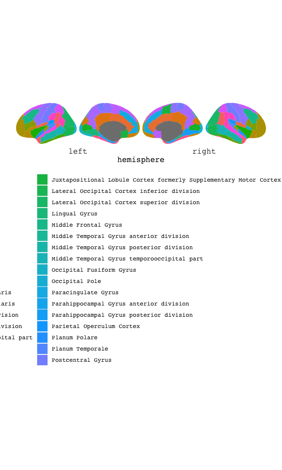

<!-- README.md is generated from README.Rmd. Please edit that file -->

# ggsegHO

<!-- badges: start -->

[](https://ci.appveyor.com/project/LCBC-UiO/ggsegHO)
[](https://travis-ci.com/LCBC-UiO/ggsegHO)
[](https://codecov.io/gh/LCBC-UiO/ggsegHO?branch=master)
<!-- badges: end -->

This package contains dataset for plotting the Harvard-Oxford cortical
atlas ggseg and ggseg3d.

Makris,et al. (2006) Schizophrenia research 83(2-3):155-151
[pubmed](https://doi.org/10.1016/j.schres.2005.11.020)

## Installation

You can install the released version of ggsegHO from
[GitHub](https://github.com/) with:

``` r
# install.packages("remotes")
remotes::install_github("LCBC-UiO/ggsegHO")
```

## Example

This is a basic example which shows you how to solve a common problem:

``` r
library(ggsegHO)
```

``` r
library(ggseg)

ggseg(atlas = hoCort, mapping = aes(fill = region)) +
  # scale_fill_brain("hoCort", package = "ggsegHO") + # no palette available
  theme(legend.position = "bottom",
        legend.text = element_text(size = 6)) +
  guides(fill = guide_legend(ncol = 2))
```



<!-- ```{r "noneval", eval=FALSE} -->

<!-- library(ggseg3d) -->

<!-- ggseg3d(atlas = desterieux_3d) %>%  -->

<!--   pan_camera("right lateral") -->

<!-- ``` -->

<!-- ```{r "orca", include=FALSE} -->

<!-- library(ggseg3d) -->

<!-- p <- ggseg3d(atlas = desterieux_3d) %>% -->

<!--   pan_camera("right lateral") %>% -->

<!--   plotly::add_annotations( text="Screen capture", -->

<!--                   legendtitle=TRUE, showarrow=FALSE, -->

<!--                   font = list(color = "#000000b4", -->

<!--                               family = 'sans serif', -->

<!--                               size = 50)) -->

<!-- plotly::orca(p, "man/figures/README-3d-plot.png") -->

<!-- ``` -->

<!-- ```{r "incl", echo=FALSE} -->

<!-- knitr::include_graphics("man/figures/README-3d-plot.png") -->

<!-- ``` -->

Please note that the ‘ggsegHO’ project is released with a [Contributor
Code of Conduct](CODE_OF_CONDUCT.md). By contributing to this project,
you agree to abide by its terms.
